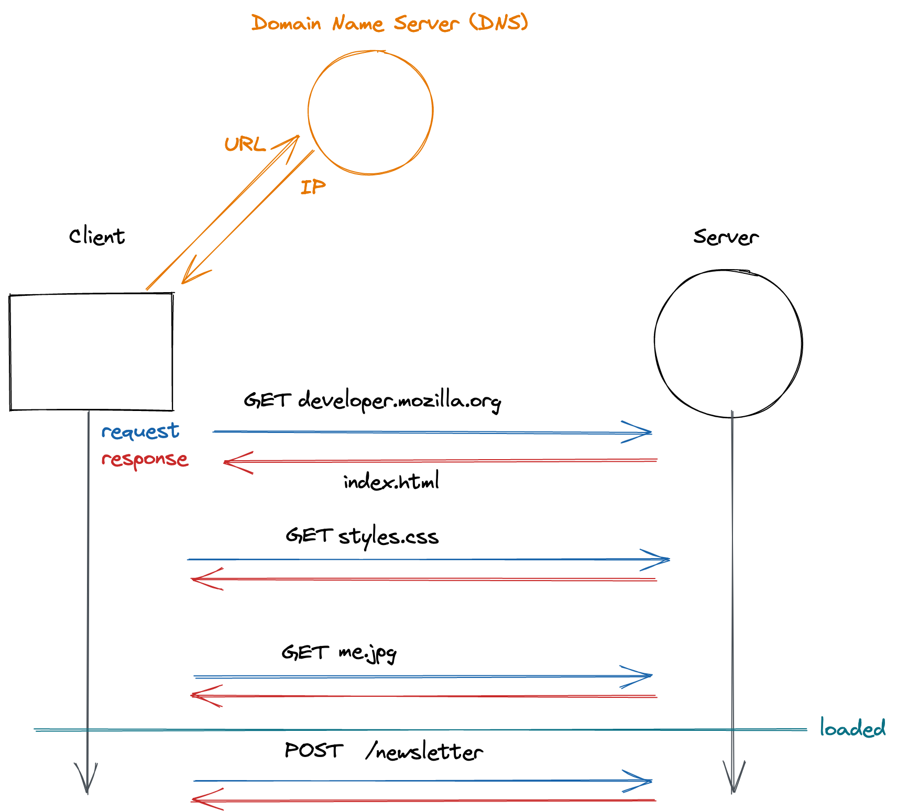
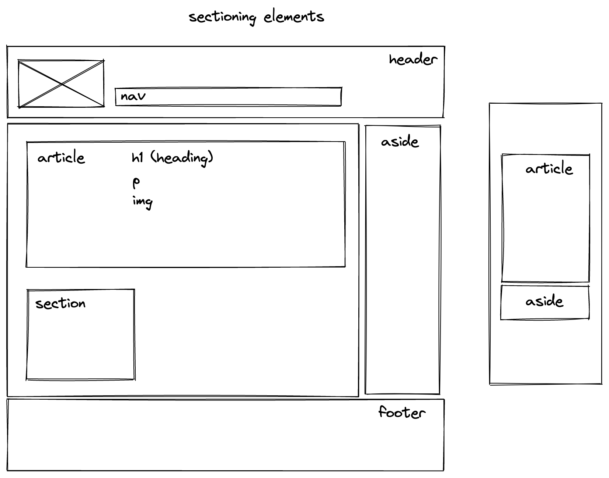

# HTML und das Web

## Lernziele

- Die Client-Server-Kommunikation verstehen
- HTML-Code schreiben
- Die Bedeutung von semantischem HTML kennen

---

## Wie das Web funktioniert

Das World Wide Web ist ein Netzwerk von Computern, die Informationen miteinander austauschen können. Es gibt viele verschiedene Protokolle, die die Regeln für die Kommunikation zwischen Maschinen festlegen. Browser verwenden HTTP (Hypertext Transfer Protocol), um mit Webservern zu kommunizieren.

- Die URL (Uniform Resource Locator) ist die eindeutige Adresse einer Ressource im Web. Sie enthält einen menschenlesbaren Domainnamen, der über einen DNS (Domain Name Server) in die technische IP-Adresse (Internet Protocol) des Webservers aufgelöst werden muss.
- Der Browser sendet eine GET-Anfrage (eine HTTP-Methode), um ein HTML-Dokument (Hyper Text Markup Language) von einem Webserver zu laden.
- Der Webserver sendet eine Antwort mit dem Dokument.
- Oft enthält der HTML-Code Verweise auf weitere Ressourcen (CSS-Dateien, Bilder usw.), die der Browser dann ebenfalls vom Server anfordert.
- Der Browser rendert den empfangenen Inhalt auf dem Bildschirm und macht ihn interaktiv.
- Browser können später über weitere GET- oder POST-Anfragen zusätzliche Daten von Servern anfordern.

---

## Webprotokolle

Es gibt viele verschiedene Protokolle, die die Regeln für die Kommunikation zwischen zwei Maschinen festlegen, zum Beispiel:

- Anfordern und Anzeigen von HTML-Dateien über HTTP (z. B. Websites im Browser öffnen)
- Zugriff auf die Shell eines anderen Computers über SSH oder Klonen von Repositories von GitHub über eine SSH-Verbindung
- Senden und Empfangen von E-Mails über TLS/SSL
- Zugriff auf Dateien auf einem Server über FTP (File Transfer Protocol)

Vorerst konzentrieren wir uns auf die am häufigsten genutzte Funktion des Webs: das Anzeigen von und Interagieren mit Websites.

Um eine bestimmte Website anzuzeigen, muss man:

1. die Adresse des Servers ermitteln, der die HTML-Datei bereitstellt, d. h. die IP-Adresse (Internet-Protokoll-Adresse)
2. eine GET-Anfrage an diese Adresse senden
3. zusätzliche Ressourcen anfordern (CSS-Dateien, Bilder usw.)
4. den empfangenen Inhalt rendern (z. B. über einen Browser)

Die meisten mit dem Internet verbundenen Computer sind über eine IPv4-Adresse erreichbar, die aus 4 Zahlen im Bereich von 0 bis 255, getrennt durch einen Punkt, besteht.

> 💡 Gib diese IP-Adresse in die Adressleiste deines Browsers ein und schau, was passiert: `172.217.203.94`

> 💡 Führe folgenden Befehl in deinem Terminal aus, um die aktuelle IP-Adresse deines Computers zu erhalten: `curl ipinfo.io`

Genauso wie es unpraktisch wäre, sich alle Telefonnummern seiner Freunde zu merken, ist es nicht sehr benutzerfreundlich, sich die IP-Adressen aller Websites zu merken. Um dieses Problem zu lösen, können Websites über eine URL wie `https://www.neuefische.de` erreicht werden. Der Browser fordert dann die IP-Adresse dieser Website von einem DNS (Domain Name Server) an – das ist im Grunde ein Telefonbuch für Domains.

Dann lädt der Browser alle notwendigen Inhalte für die Website herunter, wie die HTML-Datei, CSS- und JavaScript-Dateien, Bilder, Schriftarten usw. Sobald alle Dateien heruntergeladen sind, zeigt der Browser den HTML-Inhalt an, gestaltet ihn gemäß dem Stylesheet und führt JavaScript-Code aus. Danach kann man mit der Website interagieren.

---


## HTML-Grundlagen

HTML (Hyper Text Markup Language) wird verwendet, um Text auf strukturierte Weise darzustellen. HTML-Tags geben an, welche Art von Element auf der Website angezeigt wird. Eine Überschrift wird zum Beispiel so geschrieben:

```html
<h1>Ich bin eine Überschrift!</h1>
```

Der als Überschrift geltende Inhalt wird von einem öffnenden Tag und einem schließenden Tag umschlossen. Das Ganze nennt man ein Element.

Elemente werden ineinander verschachtelt, um Struktur und Hierarchie zu erzeugen.

```html
<h1>Ich bin eine <em>Überschrift!</em></h1>
```

Manche Elemente können keine anderen Elemente enthalten und haben daher keinen schließenden Tag. Sie sind selbstschließend und werden leere Elemente genannt.

```html
<hr />
```
oder
```html
<br />
```

---

## HTML-Tag-Attribute

Manche Elemente benötigen zusätzliche Informationen, um korrekt zu funktionieren. Diese Informationen werden über Attribute angegeben, zum Beispiel:

Die Quelle eines Bildes:
```html

```

Das Ziel eines Anker-Elements:
```html
<a href="https://example.com"> klick mich </a>
```

Der Typ eines Input-Elements:
```html
<input type="date" />
```

> 💡 Die [MDN Web Docs](https://developer.mozilla.org/de/docs/Web/HTML) enthalten detaillierte Informationen zu Elementen und den entsprechenden Attributen.

---

## Aufbau einer HTML-Datei

Jedes HTML-Dokument beginnt mit einem Doctype, gefolgt vom `<html>`-Element, das aus zwei Hauptteilen besteht:

- Der `<head>` enthält wichtige Meta-Informationen für den Browser, wie:
    - den Zeichensatz (utf-8)
    - das Favicon, das im Tab angezeigt wird
    - den Titel der Website
    - CSS- und JavaScript-Dateien, die für die Website benötigt werden
- Der `<body>` enthält den sichtbaren Inhalt der Website, strukturiert durch HTML-Elemente

```html
<!doctype html>
<html>
  <head>
    … Meta-Informationen, Links zu CSS- / JavaScript-Dateien …
  </head>
  <body>
    … auf der Webseite angezeigte Elemente …
  </body>
</html>
```

---

## Liste häufiger HTML-Elemente

| Element | Bedeutung |
|---|---|
| `<head></head>` | Nur einmal pro Website; enthält Meta-Daten und verlinkte Dateien |
| `<body></body>` | Nur einmal pro Website; enthält den HTML-Seiteninhalt |
| `<h1></h1>` | Nur einmal pro Website; eine Überschrift erster Ordnung |
| `<h2></h2>` | Eine Überschrift zweiter Ordnung |
| `<p></p>` | Ein Absatz |
| `<a></a>` | Ein Anker (Link) |
| `` | Ein Bild (selbstschließend / leer) |
| `<form></form>` | Ein Formularelement |
| `<input>` | Ein Eingabefeld (selbstschließend / leer) |
| `<button></button>` | Ein klickbares Element mit einer bestimmten Funktion |

> 💡 Eine umfassende Liste aller HTML-Elemente findet sich in den [MDN Web Docs](https://developer.mozilla.org/de/docs/Web/HTML/Element).

---

## Eine Website strukturieren

Entwickler haben zwei Hauptwerkzeuge, um einer Website eine sinnvolle Struktur zu geben:

- Verwendung von semantischen HTML-Elementen
- Verschachtelung / Gruppierung von HTML-Elementen

### Semantisches HTML

Semantische HTML-Elemente teilen den Inhalt der Webseite nicht nur in verschiedene Bereiche auf, sondern beschreiben auch die Funktion oder den Zweck der Elemente. Das hat zwei wesentliche Vorteile:

- Das HTML wird für andere Entwickler verständlicher.
- Barrierefreiheits-Tools und Suchmaschinen können die Website besser interpretieren.

Daher sollten semantische HTML-Elemente nach Möglichkeit immer verwendet werden.

### Liste semantischer HTML-Elemente

| Element | Bedeutung |
|---|---|
| `<main></main>` | Nur einmal pro Website; enthält den Hauptinhalt der Seite |
| `<section></section>` | Ein allgemeiner, eigenständiger Abschnitt eines Dokuments |
| `<ul></ul>` / `<ol></ol>` | Eine Liste von Elementen gleicher Struktur; enthält nur `<li>`-Elemente als direkte Kinder |
| `<nav></nav>` | Eine Navigationsleiste |
| `<aside></aside>` | Ein Element, dessen Inhalt nur indirekt mit dem Hauptinhalt zusammenhängt |
| `<article></article>` | Ein in sich abgeschlossener Teil der Website, der eigenständig verteilbar oder wiederverwendbar sein soll |
| `<header></header>` | Einleitender Inhalt, typischerweise eine Gruppe einleitender oder navigationsbezogener Elemente |
| `<footer></footer>` | Enthält typischerweise Informationen zum Autor, Copyright-Daten oder Links zu verwandten Dokumenten |

> 💡 Eine umfassende Liste semantischer HTML-Elemente findest du in den [MDN Web Docs](https://developer.mozilla.org/de/docs/Glossary/Semantics).

---

## HTML-Elemente verschachteln

Durch Verschachtelung werden Elemente sinnvoll zusammengefasst. Das Element, das die anderen Elemente enthält, wird Elternelement (parent element) genannt; es enthält ein oder mehrere Kindelemente (child elements).

Die folgenden Fälle sind typische Beispiele für verschachtelte Elemente:

```html
<ul>
  <li>erstes Element</li>
  <li>zweites Element</li>
  <li>drittes Element</li>
</ul>
```

```html
<article>
  <h2>Eine Überschrift</h2>
  <p>Ich bin ein Absatz…</p>
  <a href="https://www.github.com">ein Link zu einer anderen Website</a>
</article>
```

```html
<button>
  
  <span> absenden </span>
</button>
```

---

## Emmet

Visual Studio Code verfügt über ein nützliches Tool namens **Emmet**, mit dem sich durch das Eintippen bestimmter Kürzel und anschließendes Drücken der Tab-Taste sehr viel Code automatisch vervollständigen lässt. Probiere diese Kürzel in einer HTML-Datei aus und schau, was passiert:

- `!`
- `.highlight`
- `button#red`
- `ul>li.card*10`

> 💡 Weitere Emmet-Befehle findest du in diesem [Cheat Sheet](https://docs.emmet.io/cheat-sheet/).

---

## Weiterführende Links

- [MDN: Einführung in HTML](https://developer.mozilla.org/de/docs/Learn/HTML/Introduction_to_HTML)
- [MDN: Erste Schritte mit HTML](https://developer.mozilla.org/de/docs/Learn/HTML/Introduction_to_HTML/Getting_started)
- [MDN: HTML-Elemente](https://developer.mozilla.org/de/docs/Web/HTML/Element)
- [MDN: Semantische Elemente – Glossar](https://developer.mozilla.org/de/docs/Glossary/Semantics)
- [MDN: HTML-Attribute](https://developer.mozilla.org/de/docs/Web/HTML/Attributes)