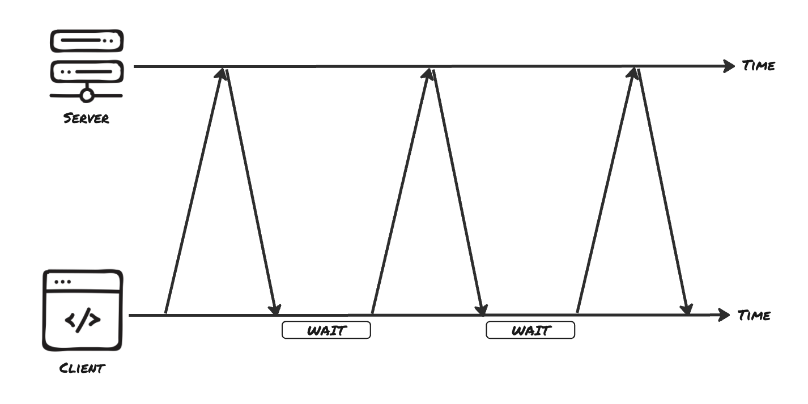

# Real-Time Communication - Short Polling

Ein grundlegendes Problem des traditionellen Request/Response-Modells ist, dass der Server den Client nicht von sich aus erreichen kann. Hier ein Beispiel: Ein Nutzer klickt auf „Export to CSV" für einen großen Datensatz. Der Server startet einen Background Job, der dreißig Sekunden zum Abschließen braucht. Der Browser hat keine Möglichkeit zu wissen, wann dieser Job fertig ist, weil der Server einen Client, der bereits aufgelegt hat, nicht zurückrufen kann. Die naheliegendste Lösung dafür ist, so lange Requests zu senden, bis der Server eine fertige Antwort hat. Das nennt man „Short Polling" und wird im Folgenden besprochen.

## Wie Short Polling funktioniert

Short Polling bedeutet, dass der Client denselben Request in einem festen Zeitintervall sendet und der Server sofort mit dem aktuellen State antwortet, egal wie dieser gerade aussieht. Es gibt kein neues Protokoll und keine spezielle Verbindung. Jeder Poll ist ein gewöhnlicher HTTP-Request, der öffnet, eine kleine Antwort übermittelt und wieder schließt, genau wie jeder andere Call an deine API.



Am Export-Beispiel sieht der Zyklus so aus:
- Der Client startet den Export und erhält eine Job-ID.
- Alle paar Sekunden fragt der Client per GET /api/exports/:id nach dem Status dieses Jobs.
- Der Server antwortet sofort mit dem aktuellen Fortschritt, unabhängig davon, ob sich etwas geändert hat.
- Sobald eine Antwort meldet, dass der Job abgeschlossen ist, hört der Client auf zu fragen.

Der Server bleibt dabei vollständig stateless. Er merkt sich nicht, dass ein Client wartet, und hält zwischen den Requests nichts offen. Er beantwortet einfach jede Frage, so wie sie eintrifft. Die gesamte „Warte"-Logik liegt beim Client.

## Polling vom Client aus

Auf der Client-Seite (Browser) ist `setInterval` das Werkzeug, um eine Aktion in einem festen Zeitintervall zu wiederholen, zusammen mit `fetch`, um den Request auszuführen.

```
// client-side
const POLL_INTERVAL_IN_MS = 3000;

function startPolling(jobId: string) {
  const intervalId = setInterval(async () => {
    const response = await fetch(`/api/exports/${jobId}`);
    const job = await response.json();

    updateProgressBar(job.progress);

    if (job.status === "done") {
      clearInterval(intervalId);
      showDownloadLink(job.downloadUrl);
    }
  }, POLL_INTERVAL_IN_MS);
}
```

`setInterval` gibt eine `intervalId` zurück, einen Handle, den du dir merken musst, um die Loop später stoppen zu können. Innerhalb des Callbacks ist jeder `fetch` ein eigener, unabhängiger Request: Der Server weiß nicht, ob es die fünfte oder die hundertste Anfrage dieses Clients ist. Das Polling wird gestoppt, indem `clearInterval(intervalId)` aufgerufen wird.

Die Server-Seite ist eine ganz normale Route, die den aktuellen State des Jobs ausliest und zurückgibt.

```
// server-side
import express, { Request, Response } from "express";

type Job = {
  id: string;
  progress: number; // 0–100
  status: "running" | "done";
  downloadUrl?: string;
};

const app = express();
const jobs = new Map<string, Job>();

app.get("/api/exports/:id", (req: Request, res: Response) => {
  const job = jobs.get(req.params.id);

  if (!job) {
    res.status(404).json({ error: "unknown job" });
    return;
  }

  res.json({
    status: job.status,
    progress: job.progress,
    downloadUrl: job.downloadUrl,
  });
});
```

Der State, den die Route zurückgibt, muss sich über die Zeit verändern, sonst sieht jeder Poll gleich aus. In einem echten System aktualisiert der Export-Vorgang selbst den Job; hier steht ein Timer stellvertretend für diese Arbeit und erhöht den Progress, bis er 100 erreicht.

```
function runExport(job: Job) {
  const timer = setInterval(() => {
    job.progress = Math.min(job.progress + 10, 100);

    if (job.progress >= 100) {
      job.status = "done";
      job.downloadUrl = `/downloads/${job.id}.csv`;
      clearInterval(timer);
    }
  }, 2000);
}
```

Jeder Poll liest dabei den Wert aus, den `runExport` bis dahin erreicht hat. Der Client sieht den Fortschritt über mehrere Requests hinweg ansteigen und hört auf, sobald der Status `done` ist.

## Die Kosten ständiger Requests

Short Polling ist einfach zu bauen, und für einen sich langsam ändernden Wert, der von wenigen Nutzern abgefragt wird, ist es eine durchaus vernünftige Wahl. Hier ein paar Nachteile, die du im Blick haben solltest:

Verschwendete Requests: Die meisten Polls liefern nichts Neues. Wenn du alle drei Sekunden während eines dreißig Sekunden dauernden Tasks pollst, enthalten neun von zehn Requests keine nützliche Information. Bei jedem HTTP-Request zahlt deine Infrastruktur trotzdem den vollen Preis für Connection-Setup, Headers, Cookies, Authentifizierungs-Checks und meist auch einen Datenbank-Lookup.

Server-Last, die mit der Anzahl der Clients skaliert, nicht mit den Events: Zehn Nutzer, die alle drei Sekunden pollen, erzeugen etwa 200 Requests pro Minute, unabhängig davon, ob gerade etwas passiert. Der Server leistet konstant Arbeit, nur um meistens „noch nicht fertig" zu antworten.

Eingebaute Latenz: Ein Prozess, der eine Sekunde nach einem Poll fertig wird, bekommt erst beim nächsten Poll eine Antwort. Ein kürzeres Intervall fühlt sich natürlicher an, vervielfacht aber die Anzahl der Requests, während ein längeres Intervall die Server-Last reduziert, die UI dafür aber träge wirken lässt.

💡 Good to know: Da jeder Poll dieselbe URL anfragt, können Browser und Proxys eine gecachte Antwort ausliefern und deinem Client veraltete Daten geben. Setze `Cache-Control: no-store` auf dem Polling-Endpoint, oder füge einen sich ändernden Query-Parameter hinzu, damit jeder Poll wirklich den Server erreicht statt den Cache.

## Denkanstoß

Stell dir vor, du müsstest das Poll-Intervall für den Export-Job festlegen. Welche Faktoren würdest du abwägen, um zwischen einem kurzen Intervall (z. B. eine Sekunde) und einem langen Intervall (z. B. dreißig Sekunden) zu entscheiden, und wie könntest du das Intervall im Verlauf des Jobs dynamisch anpassen, um Latenz und Server-Last gleichzeitig zu optimieren?

## Resources
[MDN: Using Fetch]
[MDN: setInterval]