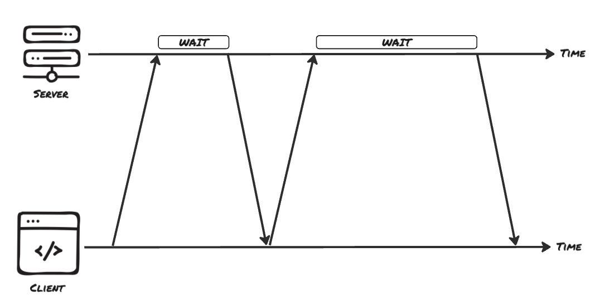

# Real-Time Communication - Long Polling

Short Polling verschwendet die meisten seiner Requests damit, zu fragen „gibt's schon was Neues?". Das eigentliche Problem des Clients ist, dass er raten muss, wann er den Request schicken soll, während eigentlich nur der Server weiß, wann es wirklich etwas zu melden gibt. Long Polling dreht das um. Statt sofort mit „nichts geändert" zu antworten, hält der Server den Request offen und sendet erst eine Antwort, wenn es tatsächlich etwas Neues zu melden gibt. Der Client schickt weiterhin einen ganz normalen HTTP-Request, aber dieser Request verhält sich jetzt wie eine offene Frage, die der Server nur dann beantwortet, wenn die Antwort es wert ist, gesendet zu werden.

## Den Request offen halten

Wenn ein Request eintrifft und sich noch nichts geändert hat, ruft der Server einfach `res.json()` nicht auf. Die HTTP-Verbindung bleibt offen, während der Server seine Aufgaben erledigt. Der Browser wartet geduldig, denn aus seiner Sicht ist das schlicht ein Request, der etwas Zeit braucht, um beantwortet zu werden.

Sobald der Server etwas Neues hat, etwa weil der Export-Job vorangeschritten ist oder fertig wurde, sendet er die Antwort und schließt den Request. Der Client empfängt die Daten, verarbeitet sie und öffnet sofort einen neuen Request, um auf die nächste Änderung zu warten. Der Effekt ist ein nahezu instantaner Strom von Updates, der vollständig aus normalen HTTP-Requests besteht, mit fast keinen leeren Antworten dazwischen.



✏️ Note: Ein offener Request kann nicht ewig warten. Browser, Load Balancer und Proxys erzwingen alle Timeouts und beenden eine inaktive Verbindung irgendwann. Echte Long-Polling-Server antworten daher nach einer maximalen Wartezeit (häufig rund 30 Sekunden), selbst wenn sich nichts geändert hat, und senden eine leere „weiter warten"-Antwort, damit der Client die Verbindung neu öffnen kann, bevor sie darunter wegtimeoutet.

## Long Polling implementieren

Der Client-Code ändert sich gegenüber Short Polling kaum. Der Unterschied ist, dass es keinen Timer gibt. Eine Antwort kommt nur, wenn es eine echte Änderung gibt, also reagiert der Client auf jede Antwort, indem er erneut fragt.

```
async function waitForUpdate(jobId: string, since: number) {
  const response = await fetch(`/api/exports/${jobId}/updates?since=${since}`);

  // The server waited, nothing changed, and it returned an empty answer.
  if (response.status === 204) {
    waitForUpdate(jobId, since);
    return;
  }

  const job = await response.json();
  updateProgressBar(job.progress);

  if (job.status === "done") {
    showDownloadLink(job.downloadUrl);
    return;
  }

  waitForUpdate(jobId, job.progress); // re-open for the next change
}
```

Der `since`-Wert ist der Cursor des Clients: der letzte Progress, den er erhalten hat. Diesen zurückzusenden erlaubt es dem Server, ein echtes Update von State zu unterscheiden, den der Client bereits hat. Jeder `fetch` löst sich erst auf, wenn der Server entscheidet zu antworten. Sobald das passiert, aktualisiert der Client die UI und ruft, sofern der Job nicht fertig ist, erneut `waitForUpdate` auf, um die offene Frage neu zu stellen. Es gibt kein `setInterval`, weil das Timing des Servers die Loop steuert, nicht eine feste Uhr.

Auf dem Server kündigt der Job seinen Fortschritt über einen Event Emitter an, denselben Emitter, in den der Export-Vorgang bei jeder Änderung schreibt.

```
import express, { Request, Response } from "express";
import { EventEmitter } from "node:events";

type Job = {
  id: string;
  progress: number; // 0–100
  status: "running" | "done";
  downloadUrl?: string;
  events: EventEmitter;
};

const app = express();
const jobs = new Map<string, Job>();

function runExport(job: Job) {
  const timer = setInterval(() => {
    job.progress = Math.min(job.progress + 10, 100);

    if (job.progress >= 100) {
      job.status = "done";
      job.downloadUrl = `/downloads/${job.id}.csv`;
      clearInterval(timer);
    }

    job.events.emit("progress", job);
  }, 2000);
}
```

Ein Long-Poll-Request, der nichts Neues zu melden hat, abonniert statt einer Antwort das nächste Event.

```
app.get("/api/exports/:id/updates", (req: Request, res: Response) => {
  const job = jobs.get(req.params.id);
  if (!job) {
    res.status(404).json({ error: "unknown job" });
    return;
  }

  const since = Number(req.query.since ?? -1);

  // The job is already past what the client has seen → answer immediately.
  if (job.progress > since) {
    res.json({
      status: job.status,
      progress: job.progress,
      downloadUrl: job.downloadUrl,
    });
    return;
  }

  // Nothing new yet: hold the request and wait for the next progress event.
  const onProgress = () => {
    clearTimeout(timer);
    res.json({
      status: job.status,
      progress: job.progress,
      downloadUrl: job.downloadUrl,
    });
  };
  job.events.once("progress", onProgress);

  // Send an empty response before a proxy closes the idle connection.
  const timer = setTimeout(() => {
    job.events.off("progress", onProgress);
    res.status(204).end();
  }, 25_000);

  // If the client disconnects while we are holding, release the listener.
  req.on("close", () => {
    clearTimeout(timer);
    job.events.off("progress", onProgress);
  });
});
```

Der `since`-Query-Parameter teilt dem Server mit, was der Client zuletzt gesehen hat, sodass dieser ein echtes Update erkennen kann, statt alte Daten erneut zu senden.
Liegt der Job bereits vor `since`, antwortet der Server sofort. Andernfalls wartet er.
`job.events.once("progress", ...)` registriert einen einmaligen Handler für die nächste Änderung. Wenn dieser ausgelöst wird, sendet der Server die Antwort und der Request endet.
Das `setTimeout` schützt davor, zu lange zu warten: Nach 25 Sekunden sendet es ein leeres `204`, damit der Client neu öffnen kann, bevor ein Proxy in ein Timeout läuft.
Der `close`-Handler entfernt den Listener und den Timer, falls der Client vorher die Verbindung trennt, damit sich keine inaktiven Handler anhäufen.

Der Emitter steht hier stellvertretend für das, was der echte Job zur Ankündigung von Fortschritt verwendet: eine Datenbank-Notification, eine Nachricht aus einer Queue, oder ein Callback vom Worker, der den Export durchführt. Das Prinzip bleibt gleich: die Antwort zurückhalten, bis es etwas gibt, das es wert ist, gesendet zu werden.

## Warum es immer noch nicht skaliert

Long Polling fühlt sich wie eine Verbesserung an, und für moderaten Traffic ist es das auch. Die Daten kommen praktisch sofort an, und der Strom sinnloser leerer Antworten ist behoben. Trotzdem hat diese Lösung noch viele Nachteile:

Jeder wartende Client hält eine Verbindung offen. Verarbeitet ein Server 10.000 Long-Poll-Requests, muss er 10.000 aktive Verbindungen aufrechterhalten. Auch wenn die meisten dieser Requests einfach nur auf Daten warten, verbrauchen sie trotzdem Memory und andere verbindungsbezogene Ressourcen.

Es gibt eine kleine Lücke zwischen den Requests. Nachdem ein Client eine Antwort erhalten hat, muss er einen neuen Request senden, um weiter zuzuhören. Tritt während dieses Intervalls ein Update auf, braucht der Server einen Weg, es festzuhalten und mit dem nächsten Request auszuliefern; sonst kann es dem Client entgehen.

Große Updates können eine Welle von Reconnects auslösen. Wenn ein Event dazu führt, dass viele Long-Poll-Requests gleichzeitig abgeschlossen werden, verbinden sich Clients typischerweise sofort wieder neu. Das kann einen kurzen Spike im Traffic und beim Connection-Handling-Overhead erzeugen.

Long Polling kann nahezu Echtzeit-Updates liefern, ohne zusätzliche Protokolle zu benötigen, bringt aber inhärenten Overhead mit sich. Es beruht darauf, HTTP-Requests wiederholt neu aufzubauen, um einen kontinuierlichen Datenstrom zu simulieren. Wenn die Kommunikation nur vom Server zum Client fließt, ist eine persistente Verbindung, die Updates liefert, sobald sie eintreten, oft der einfachere und effizientere Ansatz.

## Denkanstoß

Stell dir vor, dein Export-Job könnte sich mehrmals pro Sekunde ändern, etwa weil mehrere kleine Teilschritte parallel laufen. Welche Probleme würden bei der gezeigten Long-Polling-Implementierung auftreten, wenn zwischen dem Senden einer Antwort und dem Öffnen des nächsten Requests mehrere Updates passieren, und wie könnte der Server damit umgehen, dass der Client keines dieser Updates verpasst?

## Resources
[MDN: HTTP request methods]
[PubNub: What is Long Polling?]