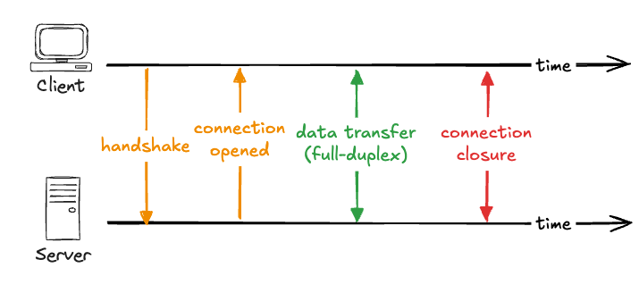

# Real-Time Communication – WebSocket Basics

Ein WebSocket ist eine einzelne Verbindung, die offen bleibt und es Client und Server erlaubt, jederzeit Daten aneinander zu senden. In diesem Kapitel geht es darum, wie diese Verbindung darunter funktioniert: wie sie als gewöhnlicher HTTP-Request beginnt und sich dann in etwas anderes verwandelt, was sie von einem normalen Request unterscheidet, und wie man eine mit den Low-Level-Tools baut, auf denen alles andere aufsetzt.



## Der Handshake

Eine WebSocket-Verbindung beginnt nicht als WebSocket. Sie beginnt als gewöhnlicher HTTP-Request mit einem zusätzlichen Header, `Upgrade: websocket`, mit dem der Client den Server bittet, diese Verbindung auf das WebSocket-Protokoll umzuschalten. Wenn der Server zustimmt, antwortet er mit `101 Switching Protocols`, und von diesem Punkt an ist die zugrunde liegende TCP-Verbindung keine HTTP-Verbindung mehr. Beide Seiten tauschen jetzt WebSocket-Messages über dieselbe offene Verbindung aus. Diese Aushandlung nennt man den Handshake.

Weil die Verbindung kein HTTP mehr ist, verwendet sie ihr eigenes URL-Schema. Du verbindest dich mit `ws://` statt mit `http://`, und mit `wss://` statt mit `https://` für die verschlüsselte Variante, die über TLS läuft.

## Full-Duplex-Kommunikation

Sobald die Verbindung offen ist, ist sie full-duplex. Bei einem klassischen Request/Response-Austausch wechseln sich die Teilnehmer ab: Einer stellt einen Request, der andere liefert eine Response. Full-duplex bedeutet, dass beide Enden gleichzeitig senden können, ohne auf eine Antwort zu warten. Der Server kann eine Message sofort pushen, wenn etwas passiert – auch während der Client gerade selbst eine sendet.

## WebSockets vs. HTTP

Ein HTTP-Request ist eine in sich abgeschlossene Transaktion: Er öffnet, sendet einen vollständigen Satz von Headers und Cookies, bekommt eine Response, und schließt. Der nächste Request startet wieder von vorne. Ein WebSocket wird einmal geöffnet und bleibt offen. Nach dem Handshake ist jede Message ein kleines Frame mit nur wenigen Bytes Overhead, gesendet von der Seite, die etwas mitzuteilen hat.

Daraus ergeben sich die Vorteile:

- **Niedrige Latenz.** Kein Verbindungsaufbau oder Handshake pro Message. Die Verbindung ist bereits offen, also geht eine Message direkt durch.
- **Geringer Overhead.** Messages sind leichtgewichtige Frames statt vollständiger HTTP-Requests, die jedes Mal Headers und Cookies mittragen.
- **Echte Zwei-Wege-Kommunikation.** Der Server kann selbst initiativ werden, nicht nur antworten – das ist der Hauptgrund, WebSockets zu verwenden.

Diese Vorteile sind nicht kostenlos, und die Kosten betreffen vor allem den State:

- **Die Verbindung ist stateful.** Der Server muss jeden offenen Socket tracken, was Speicher verbraucht und das Skalieren schwieriger macht als bei stateless Requests. Mehrere Server-Instanzen zu betreiben erfordert meist Sticky Sessions und einen Weg für die Instanzen, sich Messages zu teilen.
- **Du verwaltest Reliability selbst.** Verbindungen brechen ab. Rohe WebSockets verbinden sich nicht von selbst neu, also ist es deine Aufgabe, eine abgebrochene Verbindung zu erkennen und wiederherzustellen.
- **Die Infrastruktur muss es unterstützen.** Manche Proxys und Load Balancer brauchen explizite Konfiguration, um eine langlebige, upgegradete Verbindung offen zu halten, und Responses lassen sich nicht so cachen wie bei plain HTTP.

## Native WebSockets

Node unterstützt WebSockets nicht von sich aus, deshalb ist die übliche Low-Level-Library `ws`. Du hängst einen WebSocket-Server an denselben HTTP-Server, auf dem Express bereits läuft, und behandelst dann Connections und Messages, sobald sie eintreffen.

```javascript
import express from "express";
import { WebSocketServer, WebSocket } from "ws";

const app = express();
const server = app.listen(3000);

const wss = new WebSocketServer({ server });

wss.on("connection", (socket: WebSocket) => {
  socket.on("message", (data) => {
    // relay the message to every connected client
    for (const client of wss.clients) {
      if (client.readyState === WebSocket.OPEN) {
        client.send(data.toString());
      }
    }
  });
});
```

Der `WebSocketServer` teilt sich den bestehenden HTTP-Server, sodass der Upgrade-Handshake auf demselben Port passieren kann. Sein `connection`-Event feuert einmal pro Client und gibt dir einen Socket für genau diesen Client. Jeder Socket hat sein eigenes `message`-Event für Daten, die von diesem Client kommen. Hier iteriert der Server über `wss.clients`, die Menge aller aktuell verbundenen Clients, und schickt die Message an alle. Das ist die einfachste Art von Broadcast.

Im Browser ist der WebSocket-Client bereits eingebaut.

```javascript
const socket = new WebSocket("ws://localhost:3000");

socket.addEventListener("open", () => {
  socket.send("hello from the client");
});

socket.addEventListener("message", (event) => {
  console.log("received:", event.data);
});
```

Das Erzeugen eines `WebSocket` öffnet die Verbindung. Das `open`-Event sagt dir, dass der Handshake erfolgreich war und die Verbindung bereit ist – ab dann ist es sicher, mit dem Senden zu beginnen. Das `message`-Event feuert jedes Mal, wenn der Server Daten schickt, mit dem Payload in `event.data`. Zusammen zeigen die beiden Snippets Full-Duplex in Aktion: Der Client sendet, wenn die Verbindung öffnet, der Server leitet die Message an alle weiter, und jeder Client empfängt sie.

❗ **Achtung:** Das `ws`-Modul gibt dir das rohe Protokoll und nichts weiter. Es gibt keine automatische Reconnection und kein Konzept von Rooms oder Channels. Wenn ein Netzwerk WebSockets blockiert, gibt es keinen Fallback. Messages sind plain Strings, die du selbst serialisierst und parst. In Production willst du das selten alles selbst bauen, deshalb greifen die meisten Teams stattdessen zu einer High-Level-Library.

## Ressourcen

[MDN: The WebSocket API](https://developer.mozilla.org/en-US/docs/Web/API/WebSockets_API)
[MDN: Writing WebSocket client applications](https://developer.mozilla.org/en-US/docs/Web/API/WebSockets_API/Writing_WebSocket_client_applications)
[ws library documentation](https://github.com/websockets/ws)

## Denkanstoß

Das `ws`-Modul gibt dir nur das rohe Protokoll: kein automatisches Reconnect, keine Rooms, keine Serialisierung. Stell dir vor, du müsstest damit einen Chat mit mehreren Räumen bauen, in dem Nutzer nur Messages aus ihrem eigenen Raum sehen sollen. Welche Probleme müsstest du selbst lösen, die eine High-Level-Library wie Socket.io bereits mitbringt – und an welcher Stelle würde dir das zu mühsam werden?