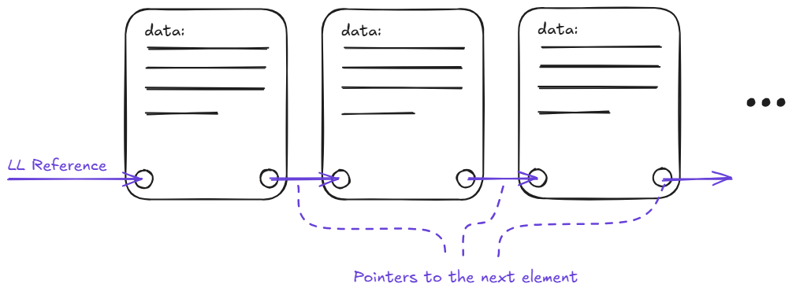
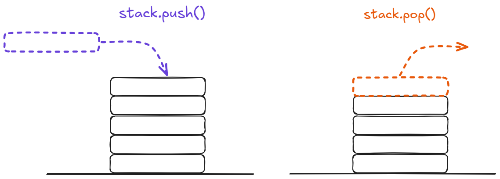
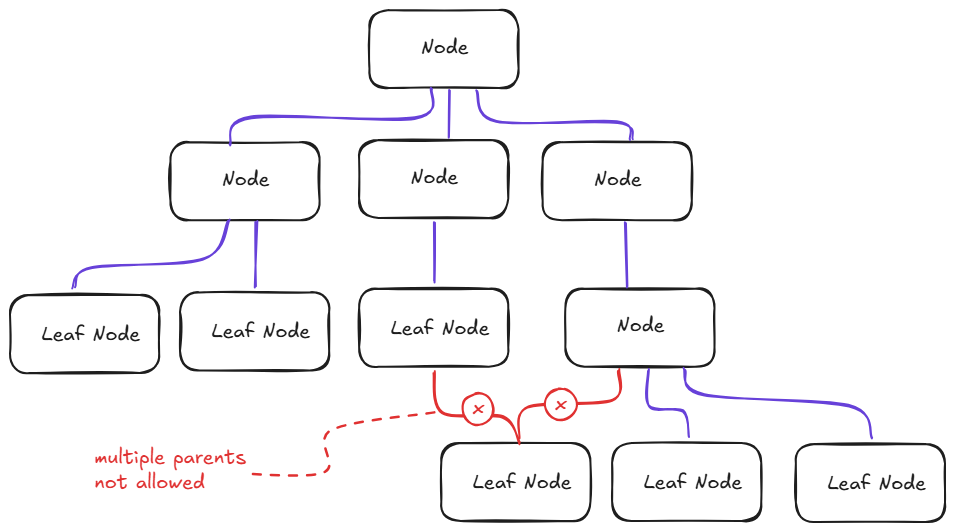

# Software Design – CS Grundlagen: Datenstrukturen

Eine Datenstruktur ist eine Methode, Werte im Speicher zu halten. Arrays und Objekte sind die beiden, die Web-Entwickler verwenden, ohne groß darüber nachzudenken. Beide funktionieren für die meisten alltäglichen Aufgaben gut – genau deshalb ist es leicht zu vergessen, dass es andere Formen gibt.

Der Grund, warum andere Formen existieren, ist folgender: Die gewählte Struktur entscheidet, welche Operationen günstig und welche teuer sind. Ein Array ist schnell beim Lesen des Wertes an Index 5 und langsam beim Einfügen eines Wertes am Anfang. Ein Objekt ist schnell beim Nachschlagen eines Schlüssels, aber ungeeignet, um eine Reihenfolge beizubehalten. Keines davon ist ein Defekt von Arrays oder Objekten – es ist eine Eigenschaft ihrer Speicheranordnung und der Operationen, die diese Anordnung begünstigt.

Dieser Abschnitt behandelt drei Strukturen, die im Hintergrund vieler Codebasen auftauchen, mit denen Web-Entwickler arbeiten: **verkettete Listen**, **Stacks** und **Bäume**. Jede basiert auf einer Idee darüber, wie Werte miteinander in Beziehung stehen, und jede macht eine andere Menge von Operationen günstig.

---

## Verkettete Listen

Eine verkettete Liste speichert Werte in einer Kette von Knoten. Jeder Knoten enthält einen Wert und einen Zeiger auf den nächsten Knoten. Die Liste selbst ist lediglich eine Referenz auf den ersten Knoten, den sogenannten **Head**. Um den fünften Wert zu finden, folgt man den Zeigern vom Head aus, bis man ihn erreicht.

Dies ist der umgekehrte Kompromiss im Vergleich zu einem Array. Ein Array hält seine Werte in einem zusammenhängenden Speicherblock, sodass der Sprung zu Index 5 eine direkte Berechnung ist. Eine verkettete Liste hält ihre Werte verstreut, sodass der Sprung zum fünften Wert bedeutet, an den ersten vier vorbeizugehen. Andererseits erfordert das Einfügen eines Wertes in die Mitte eines Arrays, jeden nachfolgenden Wert zu verschieben. Das Einfügen in die Mitte einer verketteten Liste bedeutet hingegen nur das Tauschen von zwei Zeigern – unabhängig davon, wie groß die Liste ist.

- Eine **einfach verkettete Liste** hat einen Zeiger pro Knoten, der vorwärts zeigt.
- Eine **doppelt verkettete Liste** hat zwei Zeiger pro Knoten – einen vorwärts und einen rückwärts. Sie verbraucht mehr Speicher, kann aber in beide Richtungen durchlaufen werden, und das Entfernen eines Knotens ist einfacher, da der Vorgänger ohne Durchlauf vom Head gefunden werden kann.

Web-Entwickler begegnen verketteten Listen häufiger, als sie denken. Ein **Rückgängig/Wiederholen-Verlauf** ist von Natur aus eine doppelt verkettete Liste: Jeder Schritt zeigt auf den vorherigen und den nächsten. Ein **LRU-Cache** – wie ihn ein Browser oder ein CDN verwendet, um das am längsten ungenutzte Element zu entfernen – wird üblicherweise aus einer Hash-Map kombiniert mit einer doppelt verketteten Liste aufgebaut, sodass das Markieren eines Elements als „kürzlich verwendet" ein konstanter Zeigertausch ist.

---

## Stacks

Ein Stack ist eine **Last-In-First-Out**-Sammlung (LIFO). Der zuletzt hinzugefügte Wert ist der einzige, der gelesen oder entfernt werden kann. Die zwei Operationen haben Namen: **Push** fügt einen Wert oben hinzu, **Pop** entfernt den Wert von oben. Das ist die gesamte Schnittstelle.

Die zugrunde liegende Implementierung kann ein Array oder eine verkettete Liste sein. Der Punkt ist nicht die Speicherung, sondern das Zugriffsmuster. Code, der ausschließlich push und pop verwendet, nutzt einen Stack – auch wenn die Variable, die ihn hält, ein einfaches JavaScript-Array ist.

Stacks tauchen überall auf, sobald man weiß, wonach man suchen muss:

- Der **Call-Stack** ist die Laufzeitaufzeichnung, welche Funktion gerade ausgeführt wird: Jeder Aufruf pusht einen Frame, jede Rückkehr poppt einen.
- Der **Zurück-Button** des Browsers ist ein Stack der besuchten Seiten.
- Die **Ausdrucksauswertung** – der Prozess, durch den `2 + 3 * 4` zu einer einzelnen Zahl wird – erfolgt üblicherweise durch das Pushen von Operanden und Operatoren auf einen Stack.
- Eine **Tiefensuche im DOM** verwendet einen Stack, um zu merken, welche Geschwisterknoten noch besucht werden müssen.

Push und Pop sind beide **konstante Zeitoperationen**, da sie nur das Ende der Struktur berühren. Das macht Stacks zu einer kostengünstigen Wahl, wenn das Zugriffsmuster passt.

---

## Bäume

Ein Baum ist eine **hierarchische Struktur**. Er hat einen einzelnen **Wurzelknoten** an der Spitze. Jeder Knoten kann Kindknoten haben, und jedes Kind kann eigene Kinder haben. Ein Knoten ohne Kinder wird als **Blatt** bezeichnet. Die **Tiefe** eines Knotens ist die Anzahl der Schritte von der Wurzel. Die **Höhe** des Baums ist die Tiefe seines tiefsten Blattes. Bäume sind eine spezielle Form von Graphen – ein Knoten kann niemals mehrere Elternknoten haben, wodurch keine Schleifen oder zusammenführenden Pfade entstehen können.

Bäume sind die natürliche Form für hierarchische Daten, und Web-Entwickler arbeiten bereits mit mehreren, ohne sie als Bäume zu benennen:

- Das **DOM** ist ein Baum: Das Dokument ist die Wurzel, Elemente sind Knoten, Textknoten sind Blätter.
- Ein **Dateisystem** ist ein Baum: Verzeichnisse enthalten andere Verzeichnisse oder Dateien.
- **JSON** ist ein Baum: Ein Objekt ist ein Knoten, dessen Kinder seine Schlüssel und deren Werte sind – rekursiv.

Unterschiedliche Regeln über die Anordnung von Kindern ergeben unterschiedliche Baumtypen. Ein **binärer Baum** erlaubt jedem Knoten höchstens zwei Kinder. Ein **binärer Suchbaum** fügt eine Ordnungsregel hinzu: Jeder Wert im linken Teilbaum ist kleiner als der Knoten, und jeder Wert im rechten Teilbaum ist größer.

---

## Datenstrukturen prägen Codebasen

Bei der Planung einer Anwendung denkt man vielleicht, dass das Richtigstellen der High-Level-Architektur der wichtigste Schritt ist. Aber tatsächlich ist es oft die richtige Datenstruktur für die Aufgabe, die Codebasen, mit denen das Team ständig kämpft, von Code trennt, der sich natürlich anfühlt. Die bewusste Wahl einer guten Datenstruktur ist eine der zentralen Architekturentscheidungen.

---

## Ressourcen

- [MDN: JavaScript-Datenstrukturen](https://developer.mozilla.org/de/docs/Web/JavaScript/Data_structures)
- [Wikipedia: Verkettete Liste](https://de.wikipedia.org/wiki/Verkettete_Liste)
- [Wikipedia: Stapelspeicher (Stack)](https://de.wikipedia.org/wiki/Stapelspeicher)
- [Wikipedia: Binärer Suchbaum](https://de.wikipedia.org/wiki/Bin%C3%A4rer_Suchbaum)