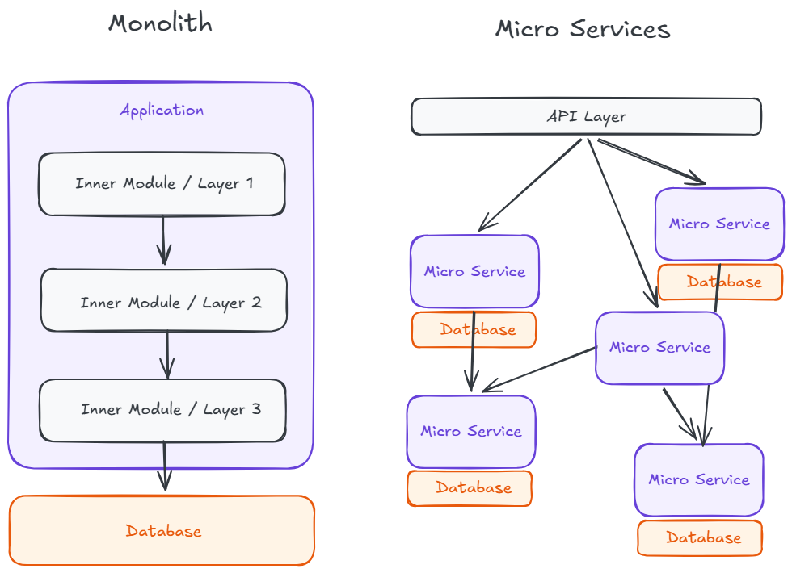
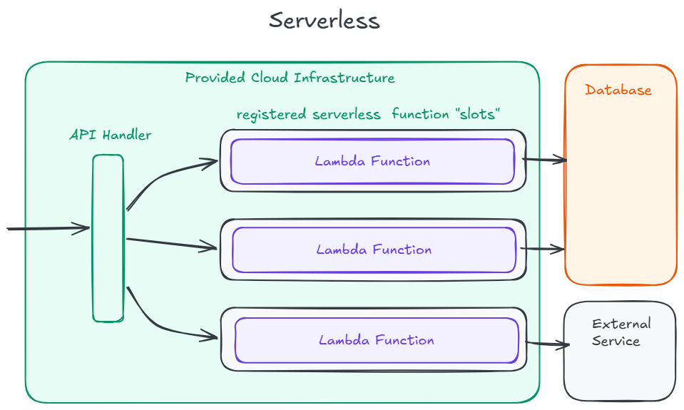
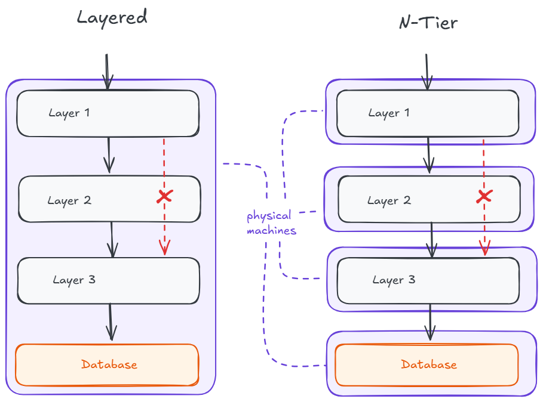

# Software Design – CS Grundlagen: Architektur

Architektur in der Software beantwortet eine Frage: Wie sind die Teile des Systems miteinander verbunden? Eine Anfrage kommt von einem Nutzer herein, Code wird ausgeführt, Daten werden gelesen oder geschrieben, und die Teile des Systems müssen dabei miteinander kommunizieren. Architekturmuster sind benannte Wege, diese Teile und die Verbindungen zwischen ihnen anzuordnen.

Zwei Ideen durchdringen den Fachjargon. Die erste ist, dass ein Muster Verbindungen beschreibt, keine Features. Es sagt, wo die Grenzen liegen, was sie überquert und welche Art von Kanal verwendet wird: ein Funktionsaufruf, eine Netzwerkanfrage, ein Ereignis. Die zweite ist, dass Muster auf verschiedenen Ebenen gelten. Ein ganzes Produkt kann ein einziger großer Prozess oder eine Sammlung von Diensten sein. Innerhalb dieses Prozesses oder Dienstes kann der Code selbst in Schichten aufgeteilt sein. Ein Muster auf einer Ebene schließt ein anderes Muster auf einer kleineren oder größeren Ebene nicht aus.

Die vier hier behandelten Muster sind **Monolith**, **Microservices**, **Serverless** und **Layered Architecture** (auch n-tier genannt). Sie können auf unterschiedlichen Granularitätsstufen angewendet werden. Monolith und Microservices betreffen die Frage, wie die gesamte Anwendung bereitgestellt wird. Serverless betrifft die Frage, ob Code als langlebiger Prozess oder nur bei Auslösung läuft. Layered Architecture betrifft die Trennung von Verantwortlichkeiten und welche Teile miteinander kommunizieren dürfen.

Echte Systeme kombinieren diese Muster. Ein typisches Webprodukt hat ein Backend, das intern oft ein Monolith ist, der in Schichten organisiert ist. Nebenaufgaben wie geplante Jobs, Webhook-Handler oder Bildverarbeitung können außerhalb dieses Monoliths als Serverless-Funktionen liegen. Viele Muster können in derselben Anwendung auf verschiedenen Ebenen vorkommen, und zu erkennen, welches auf welcher Ebene wirkt, ist hilfreicher als zu versuchen, ein einzelnes Label für das gesamte System zu wählen.

> **Hinweis:** Die besprochenen Architekturmuster sind nur eine kleine Auswahl und kein vollständiger Überblick. Ziel ist es zu verstehen, dass Systeme in sehr unterschiedlichen Formen gestaltet werden können.

---

## Monolith

Ein Monolith ist eine einzelne bereitstellbare Einheit, die die gesamte Logik der Anwendung enthält. Eine Codebasis, ein Build, eine laufende Anwendung, eine Datenbank. Wenn eine Anfrage eingeht, verarbeitet derselbe Prozess Authentifizierung, Geschäftsregeln, Datenbankzugriff und die Antwort.

Die Verbindungen zwischen den Teilen eines Monoliths sind **prozessinterne Funktionsaufrufe**. Alles lebt im gleichen Speicherbereich, sodass das Teilen von Daten kostenlos ist, Transaktionen über Module hinweg eine Datenbankverbindung nutzen und das Durchsteppen des Codes mit einem Debugger unkompliziert ist. Eine Testsuite, eine CI-Pipeline, ein Deployment.

Die Kompromisse zeigen sich bei Skalierung und Teamgröße. Ein Fehler in einem Modul kann die gesamte Anwendung zum Absturz bringen, weil es nur einen Prozess gibt. Zwei Teams, die gleichzeitig liefern, müssen dasselbe Release koordinieren. Wenn ein Teil des Systems mehr Speicher oder CPU benötigt, muss der gesamte Prozess skalieren.

Monolithen haben den Ruf, veraltet zu sein – aber das stimmt nicht. Für ein kleines Team oder ein frühes Produkt ist ein Monolith meist der richtige Ausgangspunkt, und ihn zu früh aufzuteilen schafft mehr Probleme als es löst.

---

## Microservices

Eine Microservices-Architektur teilt die Anwendung in eine Menge von Diensten auf, von denen jeder einen begrenzten Teil der Domäne besitzt – zusammen mit seinen eigenen Daten. Dienste kommunizieren miteinander über das Netzwerk, typischerweise über HTTP, gRPC oder einen Message Broker. Jeder Dienst kann eigenständig entwickelt, bereitgestellt und skaliert werden. Jedes Team kann sein eigenes Service-Repository, seine CI-Pipeline, seine interne Architektur und sogar die verwendeten Programmiersprachen besitzen.

Die Motivation entsteht aus dem Schmerz eines großen Monoliths. Zwei Teams können liefern, ohne ein Release koordinieren zu müssen, weil jedes seinen eigenen Dienst besitzt. Ein Dienst, der mehr Kapazität benötigt, kann eigenständig skalieren. Verschiedene Dienste können unterschiedliche Sprachen oder Datenbanken verwenden, wenn das einen echten Vorteil bringt.

Microservices haben jedoch ihre eigenen Nachteile. Ein Netzwerkaufruf kann auf Weisen fehlschlagen, die ein prozessinterner Funktionsaufruf nie könnte: Timeouts, Teilausfälle, Wiederholungsversuche, Duplikate. Daten, die früher in einer Datenbank lagen, liegen jetzt in mehreren – und die Konsistenz zwischen ihnen wird zum Problem der Anwendung, nicht der Datenbank. Beobachtbarkeit und die Rückverfolgung der Ursache eines Fehlers wird zu einer eigenen Disziplin, da eine einzelne Nutzeranfrage viele Dienste berührt.

---

## Serverless

Serverless ist ein Ausführungsmodell, bei dem die Plattform (Vercel, AWS, Google usw.) die Laufzeit für dich bereitstellt und skaliert. Man schreibt eine Funktion, registriert sie gegen einen Auslöser wie eine HTTP-Anfrage, eine Queue-Nachricht oder einen Cron-Zeitplan, und die Plattform kümmert sich darum, sie bei Bedarf auszuführen. Es gibt keinen Server zum Einloggen und keinen Prozess, der zwischen Anfragen am Leben gehalten werden muss.

Der Reiz entspricht dem Modell. Man zahlt nur für die Zeit, in der der Code tatsächlich läuft – attraktiv für unregelmäßige oder geringe Arbeitslasten. Skalierung ist automatisch von einem Aufruf bis zu Tausenden. Es gibt kein Betriebssystem zum Patchen und keinen untätigen Prozess zu dimensionieren.

Dieses Modell hat seine eigenen Kompromisse:

- **Cold Starts** entstehen, wenn die Plattform eine neue Instanz hochfahren muss, um eine Anfrage zu bearbeiten – die zusätzliche Latenz ist nicht immer akzeptabel.
- **Vendor Lock-in** kann zum Problem werden, da jede Cloud ihre eigene Art hat, Funktionen, Auslöser und Berechtigungen zu definieren, und eine Migration zwischen Anbietern nahezu unmöglich werden kann.
- Die Laufzeit ist **zustandslos**: Alles, was zwischen Aufrufen erhalten bleiben muss, muss woanders gespeichert werden – meist in einer Datenbank oder einem Cache.
- **Lokales Debuggen** ist umständlicher als bei einem normalen Prozess.
- Während Serverless für Apps mit geringem oder stark schwankendem Anfragevolumen kostengünstig ist, können bei hohem und stetigem Durchsatz erhebliche Kosten entstehen.

Serverless eignet sich für **ereignisgesteuerte Arbeitslasten**, geplante Jobs und Verkehrsmuster, die zwischen null und stoßartig schwanken. Es ist weniger geeignet für langläufige Aufgaben und latenzempfindliche Pfade, bei denen ein Cold Start vom Nutzer spürbar wäre.

---

## Layered Architecture (n-tier)

Eine Layered Architecture organisiert den Code innerhalb einer Anwendung in horizontale Schichten, jede mit einer klaren Verantwortung, und schränkt die Richtung der Aufrufe zwischen ihnen ein. Eine übliche Aufteilung für ein Web-Backend nennt sich **MVC** und hat drei Schichten:

- **View (Präsentationsschicht):** Verarbeitet HTTP-Anfragen und -Antworten (und View-Rendering in server-seitig gerenderten Anwendungen).
- **Controller (Geschäftslogikschicht):** Definiert und kapselt die zentralen Regeln der Anwendung.
- **Model (Datenzugriffsschicht):** Kommuniziert mit der Datenbank.

Aufrufe gehen den Stack **hinunter**. Die Präsentationsschicht ruft die Geschäftslogik auf, die Geschäftslogik ruft den Datenzugriff auf. Schichten werden nicht übersprungen (die Präsentationsschicht sollte die Datenbank nicht direkt abfragen), und Aufrufe gehen nicht aufwärts.

Der Vorteil ist, dass jede Schicht isoliert betrachtet und geändert werden kann. Das Austauschen der Datenbank-Engine sollte nur die Datenzugriffsschicht betreffen. Das Hinzufügen eines neuen HTTP-Endpunkts sollte nur die Präsentationsschicht betreffen. Die Wiederverwendung derselben Geschäftslogik für eine zweite Oberfläche – wie eine CLI – wird möglich, weil die Regeln nicht mit HTTP-Code verflochten sind.

**N-Tier** ist dieselbe Idee, auf mehrere Maschinen statt innerhalb eines Prozesses angewendet. Eine klassische Drei-Tier-Bereitstellung platziert die Präsentationsebene auf einem Server, die Geschäftslogikebene auf einem anderen und die Datenbank auf einem dritten. Die Einschränkung ist dieselbe: Aufrufe fließen in einer Richtung den Stack hinunter.

Layered Architecture kann auf einer niedrigeren Ebene als Monolith oder Microservices existieren. Ein Monolith ist intern fast immer in Schichten organisiert. Ein Microservice ist es normalerweise auch.

---

## Muster auf verschiedenen Ebenen kombinieren

Da jede Ebene eines Systems durch individuelle Muster modelliert werden kann, verwendet ein echtes System typischerweise mehrere gleichzeitig. Ein klassisches Webprodukt sieht so aus:

- Das Backend ist ein **Monolith** (eine Anwendung) oder eine Menge von **Microservices** (viele Anwendungen).
- Einige Nebenaufgaben – geplante Jobs, Webhook-Handler, Bildverarbeitung – laufen als **Serverless-Funktionen** statt als Teil des langlebigen Backends.
- Innerhalb des Monoliths ist der Code in **Schichten** organisiert – Präsentation, Geschäftslogik, Datenzugriff. Ein Microservice kann ebenfalls in Schichten strukturiert sein, wenn er groß genug ist.

Einige Muster überschneiden sich direkt. Microservices und Serverless sind ein klares Beispiel: Ein Teil des Systems, der als eigener Dienst läuft, kann als langlebiger Prozess oder als Menge von Serverless-Funktionen gehostet werden. Der „Dienst"-Rahmen betrifft Eigentümerschaft und Grenzen; der „Serverless"-Rahmen betrifft die Laufzeitbereitstellung. Dieselbe Komponente kann beides gleichzeitig sein.

**Praktische Erkenntnis:** Wenn jemand eine Architektur benennt, frage auf welcher Ebene er es meint. „Wir verwenden eine Layered Architecture" kann sich auf die Struktur eines einzelnen Dienstes oder das gesamte System beziehen. „Wir verwenden Microservices" bezieht sich typischerweise auf das System als Ganzes. „Wir verwenden Serverless" betrifft, wie ein Stück Code tatsächlich ausgeführt wird. Keine dieser Antworten widerspricht zwangsläufig den anderen.

---

## Architektur in der Praxis wählen

Angenommen, ein kleines Team beginnt mit der Arbeit an einem SaaS-Produkt. Drei Entwickler, noch keine Nutzer, eine grobe Idee: Unternehmen buchen Termine mit ihren Kunden, senden Erinnerungen und verfolgen Nichterscheinen. Sie brauchen eine erste Architektur. Die vier obigen Muster sind das Vokabular für diese Entscheidung, und ein nützlicher Weg, sie anzuwenden, ist Ebene für Ebene.

**Deployment-Form zuerst.** Ein Prozess, mehrere Dienste oder ein Schwarm von Funktionen? Drei Entwickler, die ein MVP bauen, sprechen für einen **Monolith**. Microservices würden unabhängige Skalierung und unabhängiges Deployment ermöglichen – aber keines davon ist noch ein Problem. Serverless würde automatische Skalierung pro Aufruf bieten, was für stoßartige Lasten gut ist – aber der Großteil der Anwendung ist stetiger Request/Response-Traffic, wo Cold Starts und Vendor Lock-in reale Kosten sind. Mehrere Dienste oder viele separate Funktionen auf einem Laptop, in Staging und in Produktion zu betreiben, hat von Tag eins an auch einen Preis. Jetzt aufzuteilen löst Probleme, die das Team noch nicht hat.

**Innerhalb des Monoliths** ist der Code in Schichten organisiert: Eine Präsentationsschicht für HTTP-Routen, eine Geschäftsschicht für die Termin- und Erinnerungsregeln, eine Datenzugriffsschicht für die Datenbank. Der Nutzen zeigt sich, wenn dieselbe Buchungsregel aus der Web-UI und aus einem geplanten Cron-Job für Erinnerungen ausgeführt werden muss. Wenn die Regel in der Geschäftsschicht lebt, nutzen beide Aufrufer sie. Wenn sie in einer einzelnen HTTP-Route vergraben ist, wird sie dupliziert – und später unter Druck herausgezogen.

**Ein Jahr später** verschickt das Team so viele Erinnerungs-E-Mails, dass der Erinnerungs-Job dem Rest der Anwendung Datenbankverbindungen entzieht. Der Erinnerungs-Job ist ereignisgesteuert, läuft nach Zeitplan und muss nur zur vollen Stunde skalieren. Das ist genau die Form, für die Serverless gebaut wurde. Das Team kapselt den Job aus dem Monolith heraus und betreibt ihn als Funktion, die durch einen Cron-Zeitplan ausgelöst wird. Das System ist jetzt ein Monolith plus eine Serverless-Funktion, beide intern in Schichten organisiert. Keine der früheren Entscheidungen war falsch. Das System ist an einen Punkt gewachsen, wo ein weiteres Muster den Aufwand wert war.

---

## Ressourcen

- [Wikipedia: Monolithische Anwendung](https://de.wikipedia.org/wiki/Monolithisches_System)
- [Wikipedia: Microservices](https://de.wikipedia.org/wiki/Microservices)
- [Wikipedia: Serverless Computing](https://de.wikipedia.org/wiki/Serverless_Computing)
- [Wikipedia: Mehrschichtige Architektur](https://de.wikipedia.org/wiki/Schichtenarchitektur)
- [Architecture Guide](https://learn.microsoft.com/de-de/azure/architecture/guide/)